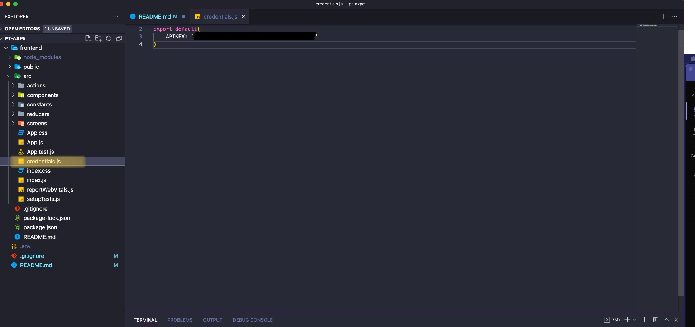

#Bienvenido a la prueba técnica de AXPE. 

Se trata de un proceso de selección el cual va dirigido a desarrolladores FrontEnd los cuales usen como lenguaje de programación JavaScript y su ecosistema. 

La prueba técnica consta de dos partes:

1. Solución/mejora de código.
2. Uso de la Api de Google Maps. Para poder levantar este proyecto se tienen que seguir pasos fundamentales, ejecutando los siguientes comandos:

```
git clone https://github.com/ro1814/pt-axpe.git. En la carpeta que desees.
cd pt-axpe
cd frontend
npm install
```
3. Una vez se instalan las dependencias del proyecto debemos crear en la carpeta frontend/src un archivo llamado credentials.js el cual escribiremos el siguiente código que se verá en la captura:




4.Debemos escribir nuestra llave API que obtenemos mediante el enlace https://developers.google.com/maps/documentation/javascript/get-api-key. Para que la misma funcione se deben dejar dato confidenciales de pago.

5.Confirmamos que estemos situados en carpeta Desde el terminal o consola debemos escribir el comando npm start y el código desarrollado se desplegará en modo desarrollo a través del enlace http://localhost:3000/

