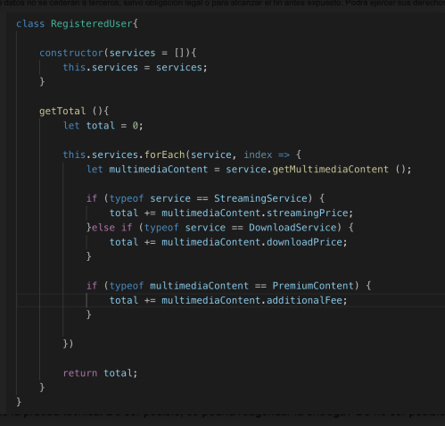
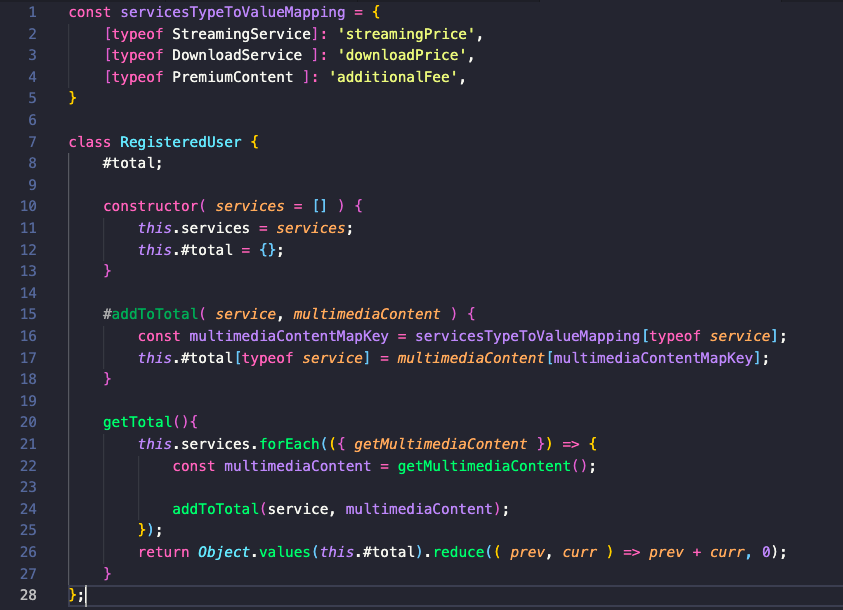

Bienvenido a la prueba técnica de AXPE. 

Se trata de un proceso de selección el cual va dirigido a desarrolladores FrontEnd los cuales usen como lenguaje de programación JavaScript y su ecosistema. 

La prueba técnica consta de dos partes:

1. Solución/mejora de código.

En el siguiente código:




Que problemas detectas en la operación y razona la respuesta.
        Respuesta:

            -El código antes visto a pesar de ser funcional carece de dinamismo y escalabilidad, esto debido a los condicionales if, else if, if que tiene. Asimismo, al tratarse de servicios (streaming/cobro) si se llegan a actualizar hay que editar muchísimos campos, con lo cual se puede recurrir a fallos mas facilmente. Al mismo tiempo, se pueden acceder a los métodos de forma pública, con lo que se pueden generar bugs al chocar con otros metodos/variables llamadas de la misma forma entre otros errores.
    
Propón una solución alternativa (también en pseudocódigo del mismo estilo) que corrija los problemas de la operación getTotal de RegisteredUser que has detectado en la pregunta anterior. Realiza todos los cambios que consideres necesarios en cualquiera de las clases del modelo del enunciado.

Solución:



2. Uso de la Api de Google Maps. Para poder levantar este proyecto se tienen que seguir pasos fundamentales, ejecutando los siguientes comandos:

```
git clone https://github.com/ro1814/pt-axpe.git. En la carpeta que desees.
cd pt-axpe
cd frontend
npm install
```
3. Una vez se instalan las dependencias del proyecto debemos crear en la carpeta frontend/src un archivo llamado credentials.js el cual escribiremos el siguiente código que se verá en la captura:


4. Debemos escribir nuestra llave API que obtenemos mediante el enlace https://developers.google.com/maps/documentation/javascript/get-api-key. Para que la misma funcione se deben dejar dato confidenciales de pago.

5. Confirmamos que estemos situados en carpeta Desde el terminal o consola debemos escribir el comando npm start y el código desarrollado se desplegará en modo desarrollo a través del enlace http://localhost:3000/

